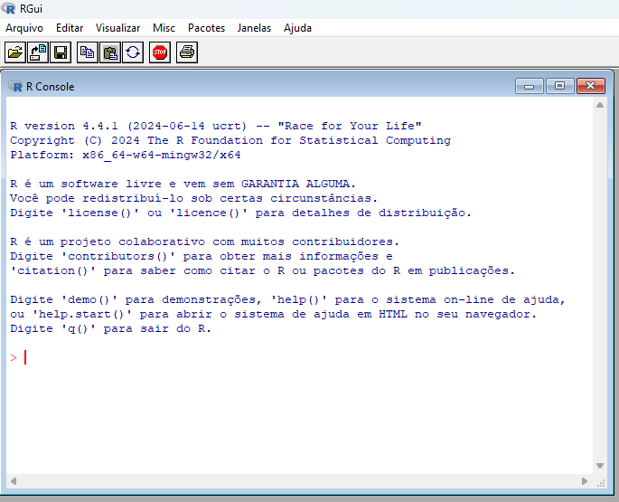
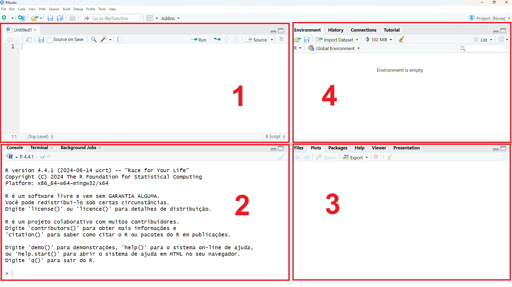

# C1 - É de comer? {.unnumbered}

> *Frequentemente ignoramos os mecanismos subjacentes dos computadores enquanto buscamos soluções para nossos problemas computacionais. No entanto, ao programar, por trás da tela há uma estrutura complexa em pleno funcionamento. Não literalmente por trás, mas você me entendeu. E, ainda que isso não seja do seu agrado, é fundamental ter alguma compreensão do que o computador de fato está fazendo por nós. Afinal, ao utilizar uma linguagem de programação, você está instruindo a máquina a executar tarefas computacionais para você (Eu mesmo, 2026).*

O R é uma linguagem de programação, o que significa que podemos utilizá-la para nos comunicar com o computador e programá-lo a executar operações. Isto é, seguimos a sintaxe ou estrutura da linguagem para construir comandos que orientem o computador na execução de operações. 

Uma definição mais específica do R é a de linguagem voltada a objetos, porque a estrutura é voltada a objetos guardados na memória do computador.

```{r}
objeto <- 1
objeto
```


No bloco acima, guardamos o valor 1 ao objeto chamado "objeto", utilizando o símbolo para atribuição (`<-` ou `=`). Podemos ler a operação, em R, como: guarde o valor 1 no objeto. Retorne objeto. E finalmente o R retorna o valor, 1.

Como uma linguagem, o R tem uma sintaxe e para dominá-la precisamos praticar. Por isso este livro é mesclado entre explicações e exemplos práticos. Não é pavê, nem pacumê. É pa praticá!

### A origem na estatística: inspiração da linguagem S instituída no Bell Labs

O que torna o R particularmente relevante para a pesquisa é o fato de ter sido concebido por estatísticos e orientado, desde sua origem, a finalidades estatísticas. Ao longo das últimas duas décadas, a linguagem também tem se consolidado no campo que passou a se estruturar como Ciência de Dados, entendido como a articulação entre estatística, computação e áreas substantivas do conhecimento, como as ciências sociais.

O R foi desenvolvido pelos estatísticos Ross Ihaka (neozelandês) e Robert Gentleman (canadense), que iniciaram o projeto em meados da década de 1990. A linguagem foi inspirada na linguagem S, criada por John Chambers e sua equipe no Bell Labs, que à época constituía uma das principais referências em computação estatística.

A primeira versão do R foi distribuída por meio de uma lista acadêmica de e-mails chamada _s-news_, que reunia pesquisadores e usuários da linguagem S. Foi nesse ambiente colaborativo que circularam os primeiros arquivos binários do que viria a se tornar o R, marcando o início de uma comunidade que rapidamente se expandiria para além daquele grupo inicial.

### Softwares de mercado _versus_ softwares livres

Com a circulação do projeto através da _s-news_, Ross e Robert receberam uma indicação de Martin Mächler, professor no Departamento de Matemática da Universidade de Zurique (Suiça), para associarem o software ao projeto GNU, da _Free Software Foundation_. A proposta foi aceita e, em junho de 1995, o código-fonte do R passou a estar disponível sob licença GNU, consolidando sua natureza de software livre. 

A história é contada em mais detalhes no artigo *R: A Language for Data Analysis and Graphics* [@ihaka_r_1996], também disponível em online [aqui](https://cran.r-project.org/doc/html/interface98-paper/paper.html), onde os autores apresentaram o projeto publicamente para a comunidade acadêmica. A partir desse momento, o R ganhou visibilidade e passou a atrair novos colaboradores. Em 1997 foi formado o R Core Group (atualmente R Core Team), responsável pela manutenção e evolução da linguagem. Esse grupo passou a coordenar o desenvolvimento do software e a gerir o Comprehensive R Archive Network (CRAN), repositório oficial onde são disponibilizadas as versões do R e os milhares de pacotes desenvolvidos pela comunidade. A versão 1.0 do R foi lançada em 2000, marcando um momento de maior estabilidade do projeto, que desde então vem sendo continuamente atualizado.

A história do R se desenvolveu na contramão dos softwares de mercado  amplamente difundidos no período, como o Statistical Package for the Social Sciences (SPSS), da IBM, e as ferramentas do pacote Microsoft Office. Enquanto esses produtos são controlados por empresas e estruturados a partir de interfaces fechadas, cujas licenças de uso são comercializadas, o R se organiza como uma linguagem de programação aberta e de livre acesso, na qual o usuário desenvolve scripts, cria novas funções e atua ativamente em uma rede integrada de usuários.

Essa diferença implica uma mudança de paradigma. Em vez de depender exclusivamente de funcionalidades previamente programadas e acessadas por menus e botões, o pesquisador passa a construir explicitamente o processo analítico por meio de códigos de programação. Isso amplia as possibilidades de personalização, documentação e compartilhamento dos procedimentos adotados. Há uma aproximação com o fluxo de trabalho com a ciência aberta. Todo o fluxo de trabalho pode ser registrado em um script ou relatório, permitindo verificação, replicação e adaptação por outros usuários.

Nesse sentido, a adesão ao projeto GNU constitui um dos pilares do R. Além disso, destacam-se alguns aspectos centrais:


- **Eficiência**: o trabalho baseado em funções e objetos permite automatizar rotinas e reduzir retrabalho, favorecendo uso mais racional de tempo e recursos computacionais.

- **Flexibilidade e potência**: por se tratar de uma linguagem de programação, o usuário não está restrito a um conjunto fixo de comandos. É possível desenvolver novas funções, adaptar métodos e integrar diferentes ferramentas.

- **Replicabilidade e transparência**: os procedimentos são explicitamente registrados em código, o que facilita auditoria, reprodutibilidade e conformidade com boas práticas científicas.

- **Comunidade e ecossistema**: o desenvolvimento colaborativo internacional sustenta a constante expansão do software, tanto no meio acadêmico quanto em instituições públicas e privadas.

### Popularização, consolidação de comunidades e mercados

Até o final da década de 2000, o R era predominantemente utilizado por estatísticos, pesquisadores acadêmicos e cientistas da computação com formação técnica específica. Esse cenário começou a se transformar com a criação do RStudio, em 2009, que ofereceu um ambiente integrado de desenvolvimento (IDE) mais acessível e intuitivo, facilitando o fluxo de trabalho e ampliando o alcance da linguagem.

Em paralelo, Hadley Wickham desenvolveu o conceito de Tidy Data [@wickham2014], propondo uma padronização estrutural para organização de bases de dados. Essa proposta conceitual deu origem a um conjunto integrado de pacotes voltados à manipulação, análise e visualização de dados, posteriormente reunidos sob o nome tidyverse. O projeto foi estruturado a partir de quatro princípios centrais: (1) reutilização de estruturas de dados existentes; (2) composição de funções simples integradas por meio de pipelines; (3) incentivo à programação funcional; e (4) produção de código legível e orientado ao usuário humano.

O impacto dessa infraestrutura foi significativo. A expansão da comunidade de usuários veio acompanhada da consolidação de um ecossistema profissional, incluindo consultorias, treinamentos e certificações. Mais do que uma mudança sintática, o RStudio e o tidyverse contribuíram para reconfigurar o posicionamento do R no mercado de usuários, especialmente na academia e em instituições de pesquisas.

### O uso da linguagem de programação nas Ciências Sociais

Dados e metodologias são os principais elementos para o trabalho com pesquisa e operacionalização de teorias. Em geral, formulamos hipóteses sobre o mundo informadas por literaturas específicas, e testamos essas hipóteses coletando dados e utilizando metodologias. As linguagens de programação nos ajudam na parte operacional de tratamento e análise dos dados.

O manuseio e a análise de dados é um desafio de longa data. Do ponto de vista do armazenamento e processamento, a principal pesquisa nacional, o Censo Demográfico, já era um desafio desde, pelo menos, 1960 [ver @barbosa2013]. Uma área que emergiu diante desses desafios é a de Ciências Sociais Computacionais, que aborda desde o desenvolvimento de algoritmos para a extração e análise de dados até a discussão teórica sobre ambientes digitais.

Ainda que a programação esteja relacionada com lógica e cálculo, não se trata apenas de informações quantitativas. Podemos tratar, além dos famosos *surveys*, também dados não estruturados, como textos, imagens, sons e tudo o mais que puder ser registrado. Tudo isso torna mais atraente a análise de dados com uso de programação, amplicando o leque de possibilidades para as Ciências Sociais.

Se você é uma pessoa curiosa e que quer explorar a criatividade, a sofisticação e a elegância em seu trabalho, está no lugar certo.

## Entendi. Então como eu uso?

Como vimos, o R é pa praticar! Então vamos colocar nossas ferramentas em mãos.

É fudamental saber que o **R é a linguagem**, e o **RStudio é o ambiente de desenvolvimento**. Não adianta tentar usar o RStudio sem o R. Portanto, faça a instalação do R e RStudio de acordo com as especificações do seu computador.

Para começar a usar o R, é preciso entender o que são e como funcionam as operações básicas. Toda linguagem de programação tem uma sintaxe e as mesmas operações básicas de lógica, relações condicionais, iterações etc. Neste capítulo, veremos os comandos básicos para guardar valores na memória e manuseá-los, operações com vetores e data.frames (dados estruturados), funções e operações de lógica.

Como uma experiência antropológica ~~e de choque~~ , abra o R (não o RStudio!). Caso tenha dificuldade em encontrar o software, digite na busca do seu computador apenas a letra "R" e procure em aplicativos.

Você deve abrir algo parecido com a janela da [Figura @fig-rconsole].

{#fig-rconsole}

A janela onde escrevemos as linhas de comandos executáveis chamamos de "console". Abrindo o R diretamente, temos apenas a janela do console para inserir os comandos. Triste, né? Mas tudo fica mais *sexy* com o RStudio. Para fins didáticos, vamos continuar com o R base. Precisamos olhar um pouco para o console como faziam os egípcios e os hebreus.

Neste livro, por ser escrito no R, temos as linhas de comando destacadas, que podem ser copiadas e coladas no console para executar.

### Primeiro contato: R como calculadora

Executar cálculos simples com o R é uma forma mais amigável de começar entender como a linguagem funciona. Podemos pensar no computador como uma grande calculadora que computa operações e, no R, como um meio para comandar o computador.

Por exemplo, no comando abaixo, eu computo um cálculo simples no R e, em seguida, recebo um resultado. Faça o mesmo no console do R base. Digite 1+2 e dê um enter para computar

```{r}
1+2
```

Legal, não é? Talvez não ainda. Mas vai ficar!

Além de números e cálculos, podemos executar outros tipos de informações como caracteres (texto) e valores lógicos (Verdadeiro e Falso). Para caracteres, devemos sempre utilizar aspas simples ou duplas, conforme a linha abaixo.

```{r}
"Utilize sempre aspas para informações textuais"
```

Para valores lógicos, usamos o inglês TRUE e FALSE, que podem ser abreviados pelas iniciais T e F, conforme a linha abaixo.

```{r}
TRUE
FALSE

T
F
```

Com o tempo, vamos escrevendo códigos (*scripts*) que compilam um conjunto sequencial de comandos. Os códigos vão ficando cada vez mais complexos na medida em que vamos trabalhando. Um recurso muito importante para torná-los interpretáveis para humanos são os comentários. Para que o R não interprete uma linha de um documento como um comando, devemos marcá-la com "\#". Toda informação que vem depois de um "\#", na linha, é descosiderada pelo R.

```{r}
# Este comentário não é executado. Simples assim.
```

Como exercício, escreva um comentário e execute no console do R base. Depois escreva o mesmo sem a marcação de comentário.

Você vai perceber que, sem indicar que é um comentário (#), o R tenta computar os valores e retorna erro, porque não consegue identificar nada associado.

Em geral, números, caracteres, valores lógicos e comentários compõem a base fundamental da linguagem R.

Vamos fazer um exercício didático para introduzir o uso de códigos. Copie as linhas de comando abaixo e cole na janela console, no R base. Você pode ir colando linha a linha e executado os comandos para observar o que acontece.

```{r, eval=F}
# Primeiro código com o R
# Autor: Victor G Alcantara

# R como calculadora

## Fazedo cálculos simples
1+2

3+5*4

10/2

## Computando texto
"Trabalhar com programação é desafiador"

## Computado valores lógicos
TRUE

FALSE
```

Uma vez compreedendo as bases, podemos operá-las utilizando a memória do computador.

Para guardar valores na memória, como objetos, utilizamos os sinais se atribuição "\<-" e "=".

-   Sinais de atribuição de valores à memória:

    -   Seta: objeto \<- valor

    -   Um igual: objeto = valor

```{r}
resultado <- 1+2

resultado
```

No exemplo acima, guardamos o cálculo 1+2 no objeto "resultado", armazenado na memória. Perceba que estamos interpretando a linha de código. O que o R interpreta é o mesmo. Podemos ler como: atribua ao objeto "resultado" o valor 1+2.

Uma vez guardado na memória, podemos nos referir ao objeto para acessar o valor, conforme ilustra o exemplo abaixo.

```{r}
resultado + 1
```

Para guardar mais de um valor em um objeto, devemos utilizar uma função para concatenar os valores, expressa por um "c" seguido de parênteses e os valores contidos, separados por vírgula.

```{r}
valores_num <- c(1,2,3,4,5)

valores_num
```

Podemos fazer operações com todos os valores guardados em um objeto. Por definição, chamamos um objeto que contenha apenas um tipo ou classe de valores como um **vetor**. Podemos dizer, assim, que criamos um vetor guardado no objeto "valores_num" que recebe os valores de 1 a 5.

Podemos fazer operações com nosso vetor, como no exemplo abaixo.

```{r}
1 + valores_num
```

Toda vez que nos referirmos ao nome do objeto guardado, sem o uso de aspas, o R vai entender que estamos nos referindo a todos os valores guardados no vetor. Por isso a soma 1 + vetor tem como resultado todos os valores + 1.

Para acessar um valor específico em um vetor, indicamos a localização do valor utilizando colchetes \[ \].

vetor\[ *posição do valor* \]

```{r}
valores_num[3] # Obtendo o valor guardado na posição 3
```

Um vetor guarda sempre um tipo ou classe de valores. Podemos fazer operações que sejam adequadas a cada tipo de valor contido. Por exemplo, para vetores que guardam textos, não podemos fazer cálculos (o R retornará erro).

```{r}
valores_chr <- c("A","B","C","D","E")
valores_chr

valores_chr[1] # Obtendo o valor guardado na posição 1
valores_chr[3] # Obtendo o valor guardado na posição 3
```

```{r, error = TRUE}
valores_chr + 1
```

Não se assuste com a mensagem de erro. Ela sempre aparecerá com alguma explicação que te ajudará a entender. Neste caso, ele está dizendo que o argumento não é um valor numérico para fazer cálculo. O R se esforça para ser nosso amigo e muitas vezes, quando notar que pode ter algo errado, vai nos avisar com *Warning*.

Embora tente ser nosso amigo, ele pode te frustrar com a quantidade de problemas e erros que aparecerão no seu caminho. Mas nunca se esqueça de que o R é burro e o inteligente é você!

Há uma outra função para concatenar objetos e valores que é muito útil e pode ser incorporada entre os comandos básicos: a função *paste*.

```{r}
paste("O primeiro valor guardado no vetor de caracteres é", valores_chr[1])
```

O que a função *paste* faz, simplesmente, é colar textos com valores guardados em objetos. Há também uma versão semelhante, que cola os valores sem adicionar espaçamento: *`paste0`.*

```{r}
paste0("O primeiro valor guardado no vetor de caracteres é",valores_chr[1])
```

A diferença é sutil, mas muito importante. Quando queremos construir o endereço do arquivo no nosso computador, por exemplo, não é usual adicionar espaços; pode ocasionar em erro. Por isso, a função `paste0` torna-se mais usual.

```{r}
nome_arquivo <- "meusdados.csv"
endereco_pasta <- "G://meucomputador/pasta/"

paste0(endereco_pasta,nome_arquivo)
```

Os comandos para comentar, atribuir valores a objetos e concatenar valores são a essência do R e serão a sua base daqui para frente. Agora, precisamos do RStudio para avançar de uma forma mais intuitiva e atrativa.

### Explorado comandos com RStudio

Abra o RStudio no seu computador.

Você deve abrir algo parecido com a [Figura @fig-rstudio]. Uma das inovações deste ambiente de trabalho é dividir o fluxo em quatro janelas: 1) script; 2) console; 3) gestão de aquivos e *outputs* e; 4) ambiente global (gestão de memória).

{#fig-rstudio}

-   <div>

    1.  **Editor de Scripts**: Essa janela é sua amiga da organização! É onde você escreve e salva seu código em arquivos. Em vez de rodar cada comando diretamente, você pode escrever vários comandos e depois executá-los da forma que quiser, selecionando partes ou tudo, quando estiver pronto.

    </div>

-   <div>

    2.  **Console**: É onde a mágica acontece! É a mesma janela que abrimos no R base. Aqui você executa comandos e vê os resultados imediatamente. Pense nele como uma "calculadora" poderosa: basta digitar o código, apertar Enter, e o R responde!

    </div>

-   <div>

    3.  **Files/Plots/Packages/Help**: Essa janela multifuncional é super versátil. No **Files**, você navega nos arquivos do projeto; em **Plots**, visualiza gráficos; em **Packages**, gerencia as bibliotecas instaladas; e em **Help**, encontra ajuda para funções e pacotes. É um verdadeiro canivete suíço para explorar recursos e referências do R!

    </div>

-   <div>

    4.  **Ambiente/Histórico**: Aqui fica o “quadro de controle” dos seus dados e variáveis. No **Ambiente**, você vê todas as variáveis e dados carregados na sessão, enquanto o **Histórico** mostra os comandos que você já executou. Se você quiser repetir ou ajustar um comando anterior, é só buscá-lo aqui.

    </div>

Agora, com o RStudio, registraremos nossos códigos no editor de script. Caso já não tenha um script R aberto, isto é, não esteja aparecedo a tela 1 do editor de script, crie uma nova no botão "+", localizado no canto superior esquerdo da tela. Perceba que podemos criar diversos tipos de arquivos para edição. O RStudio comporta, inclusive, arquivos para serem executados em outras linguagens, como Python, C++ e SQL.

Seguindo a sintaxe da linguagem e as funções disponíveis, escrevemos nossos códigos no editor de script. Em nosso curso, veremos comandos e funções importantes para importação, tratamento, manuseio e análise de dados. Mas para um bom domínio da ferramenta, é importante entendermos os fundamentos de como ela opera.

Por convenção, seguimos padrões de escrita do código, que chamamos de **identação**. A identação auxilia a deixar o código organizado e interpretável para humanos. Isso mesmo que você entendeu, identação é simplesmente uma foma convencional de organizar a escrita dos códigos. Mesmo os softwares de desenvolvimento, como o RStudio, são capazes de interpretar padrões de identação. Por exemplo, quando iserimos um comentário com "\#" e finalizamos com traços "----", o RStudio entende que se trata de um título para um segmento do código. Veremos como fazer isso mais pra frente.

Em geral, orgaizamos os códigos seguindo a lógica do fluxo de trabalho. Que pode ser descrito por:

-   **Setup e configurações básicas**
-   **Armazenamento e importação de dados**
-   **Manuseio de dados**
-   **Análise de dados**
-   **Exportação dos resultados**

Agora, vamos retomar os fundamentos da linguagem R em um script organizado usando o RStudio.

### Funções

Além dos comandos básicos, podemos também usar funções, que são comandos já programados para executar determinados procedimentos. Elas são algoritmos que fazem um determinado procedimento. São caixas pretas onde colocamos um *input* e recebemos um *output*.

A estrutura das funções no R é a seguinte: escrevemos o nome da função, seguido de parênteses dentro dos quais vão os argumentos de entrada (*inputs*).

***função*** ( argumento 1 = isso, argumento 2 = aquilo )

Por exemplo, a função "sum" faz a soma de um conjunto de valores, como o "=SOMA( )" no Excel.

```{r}
sum(1,2)
```

Algumas operações de cálculo também são codificadas como funções no R. É o caso de módulo para extrair valores absolutos e da raíz quadrada, por exemplo.

```{r}
abs(-4) # Função abs para extrair valores absolutos

sqrt(4) # Função sqrt (Square Root) para extrair raíz quadrada
```

Como demonstrado acima, a estrutura das funções no R é dada pelo nome da função (ex. "sum"), seguido de argumentos inseridos dentro de parênteses "( argumentos aqui )". Nem todas as funções exigem argumentos, mas todas as funções executam algum procedimento. Por exemplo, temos um conjunto de funções muito úteis para limpar a memória local (o que ajuda no processamento) e obter o diretório (pasta) principal onde estamos trabalhando.

-   gc( ) : de "Garbage Clean", para limpeza da lixeira e liberação de memória.

-   getwd( ) : de "Get Working Directory", para obter diretório base no qual está trabalhando.

```{r}
gc()  

getwd()
```

Há um conjunto extenso de funções de base do R, que já vem com o software na instalação. Existem especialmente funções para gestão de memória, armazenamento, dados e estatística. Além do R base, há também um universo de funções programadas pela comunidade de usuários em diversos domínios, como ciências ambientais, psicologia, economia e até funções criadas por sociólogos! Diferente das funções do R base, essas estão associadas a pacotes externos que devem ser instalados e carregados. Isso veremos na próxima aula, quando abordaremos o manuseio de dados.

### Data.frame: dado estruturado

Com os comandos básicos que vimos anteriomente, vamos iniciar a construção de uma base de dados.

Vimos que um conjunto de valores de mesmo tipo/classe pode ser guardado em um vetor, armazenado na memória local como um objeto. Por definição, os vetores são represetados como colunas.

Temos um conjunto de funções úteis no manuseio de objetos, para saber o tamanho e o tipo/classe.

-   class( ) ou typeof( ) : funções para verificar o tipo de objeto

-   lenght( ) : função para verificar o tamanho do objeto

```{r}
# Vetor de nomes, do tipo caracteres (chr)
nome <- c("Carlos","Maria","Renata","Cleber","Joana")

# Vetor de idade, do tipo numérico (num)
idade <- c(18,14,45,16,33)

# Vetor de posicionamento político à esquerda, do tipo lógico
esquerda <- c(T,F,T,F,T)

# verificando o tipo/classe dos vetores
class(nome)
class(idade)
class(esquerda)

# verificando tamanho dos vetores
length(nome)
length(idade)
length(esquerda)
```

Conforme veremos a seguir, essas funções valem também para outros tipos de objeto, como o data.frame.

Quando temos vetores de igual tamanho (com a mesma quantidade de valores), podemos uni-los em uma nova estrutura de dados, chamada data.frame. O data.frame é a famosa estrutura retangular de dados que conhecemos, com os casos nas linhas e variáveis nas colunas, como no *survey* tradicional. Portanto, para criar uma base de dados no R, basta ter os vetores de igual tamanho e uni-los em um data.frame.

```{r}
# Construindo base de dados com vetores de igual tamanho
meus_dados <- data.frame(nome,idade,esquerda)

class(meus_dados)

meus_dados
```

Observe que cada vetor contido na base de dados é de um tipo. Todo o tratamento e análise das variáveis depende disso, como veremos adiante.

Quando tratamos de vetores, vimos que para acessar os valores contidos era peciso usar colchetes e o endereço do valor. Agora, com data.frame/dados estruturados, precisamos indicar duas entradas para localizar o valor \[ linha , coluna \].

```{r}
# Localizando o terceiro valor do vetor "nome"
nome[3]

# Localizando o nome "Renata" na base estruturada
meus_dados[3,1] # Linha = 3, Coluna = 1
```

Quando não inserimos nada, o R entende que não estamos especificando a localização e, assim, queremos tudo.

```{r}
meus_dados[,] # Todos os valores em todas as colunas

meus_dados[,2] # Todos os valores da coluna 2

meus_dados[3,] # Todos os valores na linha 3
```

Podemos também localizar mais de um valor, inserindo o conjunto específico de localização.

```{r}
meus_dados[ c(1,3) , 1 ]
```

Há também outro método para localizar valores em data.frame, usando o cifrão (\$). Quando inserimos o nome do objeto onde está guardada a nossa base de dados, podemos utilizar o cifrão para indicar a coluna que queremos acessar, como no exemplo a seguir.

```{r}
meus_dados$nome
```

Muitas vezes é mais prático manusear as variáveis usando a localização pelo cifrão. Podemos também combinar o cifrão com o colchetes, como a seguir:

```{r}
meus_dados$nome[2]
```

Esses são os métodos para localizar e selecionar valores com o R base. Mais a frente, veremos formas mais intuitivas de fazer isso. Mas é fundamental saber a base, porque todo o resto vem daqui.

### Relações lógicas

Agora que vimos o fundamento dos vetores e a construção de uma base de dados, vamos fechar este capítulo com um último tópico de fundamentos: as relações lógicas.

Podemos relacionar dois valores em testes lógicos que retornam um resultado. São quatro as formas principais de teste lógico:

1.  Se algo é maior que outro, usando o símbolo " \> "
2.  Se algo é menor que outro, usando o símbolo " \< "
3.  Se algo é igual a outro, usando " == "
4.  Se algo é diferente de outro, usando " != "
5.  Se algo está contido em outro, usando %in%
6.  Se algo não está contido em outro, usando a exclamação (!) com o %in% (isso não é tão simples, veja a estrutura nos exemplos)

Também podemos combinar as relações com:

1.  Maior ou igual "\>="
2.  Menor ou igual "\<= "

```{r}
# Relações lógicas são operações em que testamos uma sentença tendo como resultado: TRUE (T) ou FALSE (F)

2 >  2  # MAIOR QUE
2 < 2   # MENOR QUE
2 == 2  # IGUALDADE

2 >= 2 # MAIOR OU IGUAL

"eu" == "todo mundo" # Igualdade
"eu" == "eu"
"eu" != "vc"         # Diferença

# Por quê igualdade são dois sinais?
# R: Porque apenas um significa atribuição de valor. Igual a setinha.

# Teste em grupo
"eu" %in% c("vc","todo mundo") # Generalização - se contém

# Nota importante: "!" opera como um sinal de negação/diferença

!( "eu" %in% c("vc","todo mundo") )
```

As relações lógicas são fundamentos da programação e podemos usar em muitos comandos. Por exemplo, para filtrar e selecionar nosso banco de dados. Antes de entrar nesses procedimetos, vamos usar fazer alguns testes lógicos usando nosso banco de dados. Tente ler e interpretar os seguintes testes:

```{r}
meus_dados[ 1 , 2 ] >= meus_dados[ 5 , 2 ]

# Leitura: o valor da linha 1, coluna 2 é maior ou igual ao valor da linha 5, coluna 2?
```

```{r}
meus_dados[  , 2 ] >= 18

# Leitura: os conjunto de valores da coluna 2 (idade) é maior ou igual a 18?

```

Agora, usaremos o resultado do teste lógico para filtrar os casos da nossa base de dados. Primeiro, é preciso guardar o resultado do teste lógico em um objeto.

```{r}
maior_ou_igual_18 <- meus_dados[  , 2 ] >= 18
maior_ou_igual_18
```

Agora, utilizaremos os valores para filtrar os casos nas linhas. Quando o valor lógico é igual à TRUE, o R retorna o valor, quando é FALSE, não retorna.

```{r}
# Exemplo antes de complexificar
meus_dados[ c(F,F,T,F,F) , ]

# No exemplo acima, indicamos somente o terceiro valor como TRUE, para filtrar.

meus_dados[ maior_ou_igual_18 , ]

```

Não se assuste com o uso da lógica para manusear os dados. Mais a frente, veremos caminhos para executar esses comandos de uma forma mais amigável e intuitiva, seguindo os passos do projeto *tidy data* do Hadley Wickham, especialmente o princípio de escrita de códigos interpretáveis para humanos.

### Extra: Google Colab

Uma alternativa para trabalhar com o R é usar o ambiente virtual da Google: o *Google Colaboratory* ou simplesmente Colab. Para isso, basta fazer login com uma conta google e criar um *notebook.* Para trabalhar com o R, é necessário editar as configurações. Para isso, vá em editar \> configurações do notebook \> altere de Python 3 para R.

{#fig-gcolab1}

{#fig-gcolab2}

Diferente do RStudio, o Google Colab possui apenas uma janela principal que intercala texto e blocos de códigos. O uso é bastante intuitivo, embora os recursos sejam limitados. Para obter maior capacidade de processamento e memória, é necessário pagar.

## Desafio

Utilizado o RStudio ou Google Colab, exercite os conhecimentos tratados neste capítulo no desafio a seguir.

```{r}
# Desafio ----
# Autor: Seu nome aqui

# 1. Crie três objetos que guardam vetores com valores 
# de tipos diferentes (numérico, caracteres e lógicos)

# 2. Verifique se os vetores têm o mesmo comprimento/
# qtd. de valores

# 3. Crie um data.frame/base de dados com os vetores

# 4. Localize o valor guardado na posição 
# seus_dados[2,1] : segunda linha e primeira coluna

# 5. Faça um teste lógico para verificar se o primeiro valor do vetor
# numérico é maior ou igual ao último valor do mesmo vetor.
# Faça para o vetor e para a base de dados

# 6. Crie uma nova coluna para a sua base de dados
# a quarta coluna deve ser um produto da 
# coluna numérica multiplicada por 2

# 7. Crie uma nova coluna para a sua base de dados
# a quinta coluna deve ser uma combinação dos valores
# formando a frase:
# O valor X multiplicado por 2 é igual a Y

```
